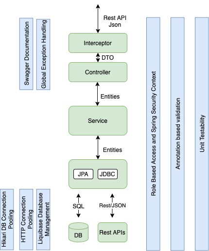

# How to start up 
Do the below steps to get the API blueprint up and running entirely in a local developer workstation
* The API blueprint requires a postgre sql database
* Create the database:here we name the db as ref_price_dev
```dtd
CREATE DATABASE ref_price_dev
    WITH
    OWNER = postgres
    ENCODING = 'UTF-8'
    TEMPLATE template0
    LC_COLLATE = 'C'
    LC_CTYPE = 'C'
    CONNECTION LIMIT = -1;
```
* Grant required permission to a preferred user: here we name the db user as ref_price_user
```dtd
CREATE ROLE ref_price_user NOSUPERUSER NOCREATEDB NOCREATEROLE NOINHERIT LOGIN PASSWORD 'password';
GRANT ALL ON DATABASE ref_price_dev TO ref_price_user;
GRANT ALL PRIVILEGES ON DATABASE ref_price_dev TO ref_price_user;
GRANT ALL ON DATABASE ref_price_dev TO postgres;

```
* Set the active profile to local
```dtd
export spring_profiles_active=local
```

* Set all the database parameters appropriately in the application-local.proporties file in the test folder
```dtd
#Auth parameters
resolved.introspect.url=http://10.133.201.10:8080/v1/auth-service/introspect

#database parameters
resolved.db.jdbcUrl=jdbc:postgresql://localhost:5432/ref_price_dev?characterEncoding=utf8&useSSL=false
resolved.db.username=ref_price_user
resolved.db.password=password
```
* Add a server entry to the local maven settings.xml file similar to the following
```dtd
    <server>
      <username>username</username>
      <password>password</password>
      <id>https://syscobt.jfrog.io/syscobt</id>
    </server>

```

* Run the unit tests
```dtd
gradle test
```
* Running unit tests will bring the databse upto current status before runing the tests

# API Blueprint 
A template implementation of a microservice based on Spring Boot. This implementation includes commonly required 
infrastructure for a microservice in Sysco echo system. Using this template will help teams setup a standard micoroservice below
capabilities.

* Adherence to 12-factor architecture style.
* Distinct layers for Controller,Service,DAO
* Ability to do Test Driven Development (TDD) in all the layers. Samples included.
* AWS SSM based secure application configurations 
* Ability to have multiple profiles(environments) 
* Data access via JPA for ORM based data access
* Data access via JDBCTemplate for complex queries not compatible with ORM
* Database connection pooling for postgre database
    * Hikari
* Ability to capture changes to the entities for audit purposes
    * JPA interceptors and database triggers
* Automated database change management
    * liquibase
* Sample database with required tables and sample ORM configurations
    * postgre sql 
* Standard logging with Correlation Id to identify related log entries
    * logback
* Standard validation of entities using built-in annotation & custom annotations 
    * javax.validation
* Automated swagger documentation


 
##Application properties

API Blueprint reads all its profile specific properties from AWS parameter store so that all the application properties 
are managed centrally in a secured environment.All the sensitive parameters are store encrypted.

###AWS Spring Cloud
API Blueprint users Spring Cloud framework based configuration management. The defaults ```bootstrap.properties``` file 
has the default configuration required for Spring Cloud.
```dtd
cloud.aws.credentials.instanceProfile=false
cloud.aws.credentials.useDefaultAwsCredentialsChain=true
cloud.aws.stack.auto=false
cloud.aws.region.auto=false
cloud.aws.region.static=us-east-1

aws.paramstore.prefix=/ref-price/config
aws.paramstore.defaultContext=application
aws.paramstore.profileSeparator=_
aws.paramstore.failFast=true
aws.paramstore.name=ref-price-service
aws.paramstore.enabled=true

```
Note that by default ```aws.paramstore.enabled``` is enabled. So that under default conditions, you need to have the required AWS access to fetch the profile specific properties.
Above configuration assumes that application will run in ```cloud.aws.region.static=us-east-1``` region.

###AWS Credentials
API Blueprint requires an AWS connection to read the parameters. So store the AWS token in the file ``` ~/.aws/credentials```.
In Sysco AWS, credentials get expired every one hour so its required to refresh this file in sufficient a frequency.
```dtd
[default]
aws_access_key_id = xxxxxxxxxxxxx
aws_secret_access_key = tX4xxxxxxxxxxxxx
aws_session_token = IQxxxxxxxxxxxxxxx     
```

###Disable AWS Spring Cloud
Optionally you can disable AWS parameter store based properties and read them from the local properties file. 
This is desired only in developer workstation in order to avoid having to refresh AWS credentials.
Use the spring profile ```local``` for this mode so that ```boostrap-local.properties``` will dictate 
over the default ```boostrap.properties```
eg:
```dtd
java -jar <jarfilename> -Dspring_profiles_active=local
```

and ```application-local.properties``` will inject the other required properties.


###Recommended Profiles

* local<br>Used when running the application in developer workstation without a vpn connection Sysco AWS cloud

* dev<br>Used when running the application in developer workstation or in cloud environment using the aws cloud based properties related to dev profile.

* qa<br>Used when running the application in a cloud environment using the aws cloud based properties related to qa profile.

* prod<br>Used when running the application in production

###Set active spring profile to enable the required profile based properties
```dtd
export spring_profiles_active=dev
```


## Features Built into the Framework

## Layered Architecture



### Controller Layer

* Handles the http requests and responses.
* Uses DTO(data transfer objects) to represent the data from/to requests/responses.
* Handles the url mapping and API versioning.
* Handles exceptions to enable appropriate error messages.
* Handles first level of validations of the incoming DTO objects
* Swagger documentation
* eg:
```dtd
@RestController
@RequestMapping("/api-blueprint")
@Slf4j
class BookController {
    Logger logger = LoggerFactory.getLogger(BookController.class);

    @Autowired
    private BookService bookService;
    @GetMapping("/v1/books/{id}")
    public @ResponseBody
    Optional<Book> get(@PathVariable("id") Long id) {
        return bookService.findById(id);
    }

    @PostMapping("v1/book")
    @ApiOperation(value = "Creates a new book", notes = "Returns the newly created Book with its auto assigned Id", code = 201, response = Book.class)
  
```
#### Testing in the Controller Layer
* Uses mock based testing.
* @WebMvcTest and @MockBean tag.
* Required to mock the services layer as appropriate.
* Uses @WithMockUser for authentication/authorization.
* eg:
```dtd
@WebMvcTest(BookController.class)
@EnableAutoConfiguration
class BookControllerTest {

    private final String API_PATH = "/api-blueprint/v1";
    @Autowired
    private MockMvc mvc;

    @MockBean
    private BookService bookService;
    @Autowired
    private BookController bookController;
   @Test
    @WithMockUser(username="admin",roles={"USER","ADMIN"})
    public void whenSavingUpdatedBook_returnsUpdatedBook()
            throws Exception {
        BookDTO bookDTO = new BookDTO("Life in Jail", "ISBN 978-0-596-52068-7", "Rohana Kumara");
        String bookJson = new ObjectMapper().writeValueAsString(bookDTO);
        Book bookToBeSSaved = new Book(bookDTO.getName(), bookDTO.getIsbn(), bookDTO.getAuthor());
        Book bookSaved = new Book(bookDTO.getName(), bookDTO.getIsbn(), bookDTO.getAuthor());
        bookSaved.setId(100L);
        //mock the expected response from the service
        when(bookService.save(bookToBeSSaved)).thenReturn(bookSaved);
        mvc.perform(MockMvcRequestBuilders.post(API_PATH + "/book")
                .content(bookJson)
                .contentType(MediaType.APPLICATION_JSON))
                .andExpect(status().isCreated())
                .andDo(print());
        bookSaved.setName("Life in a Jail");
        String savedBookJson = new ObjectMapper().writeValueAsString(bookSaved);
        //mock the expected response from the service
        when(bookService.save(bookSaved)).thenReturn(bookSaved);
        mvc.perform(MockMvcRequestBuilders.put(API_PATH + "/book")
                .content(savedBookJson)
                .contentType(MediaType.APPLICATION_JSON))
                .andExpect(status().isOk())
                .andExpect(jsonPath("$.name", is(bookSaved.getName())))
                .andExpect(jsonPath("$.isbn", is(bookSaved.getIsbn())))
                .andExpect(jsonPath("$.id", is(bookSaved.getId().intValue())))
                .andDo(print());
    }
```
### Service Layer

* Main logic layer
* Transactions and validations enabled
* Service layer methods are secured with Spring security 
* eg:
```dtd
@Service
public class BookServiceImpl implements BookService {
    @Autowired
    BookRepository bookRepository;

    @Override
    @Secured ({"ROLE_USER", "ROLE_ADMIN"})
    public Optional<Book> findById(Long id) {
        return bookRepository.findById(id);
    }

    @Override
    @Transactional
    @Secured({"ROLE_ADMIN"})
    public Book save(Book book) {
          return bookRepository.save(book);
    }
}

```
#### Testing in the Service Layer
* Uses real service classes (Minimize the mocking)
* Tests are transactional and data used for testing rolled back
* Repository layer is tested as well
* Uses @WithMockUser for authentication/authorization
* eg:

```dtd
@EnableAutoConfiguration
@RunWith(SpringRunner.class)
@SpringBootTest
@Transactional
class BookServiceTest {

    @Autowired
    BookService bookService;
    @Test
    @WithMockUser(username="admin",roles={"ADMIN"})
    public void givenAuthenticated_whenCallServiceWithSecured_thenOk() {
        Book bookToCreate=new Book("Back door deals","ISBN 978-0-596-54068-7","Sisil Gamage");
        Book bookSaved=bookService.save(bookToCreate);
        assertNotNull(bookSaved.getId());
    }

```


### The Repository Layer

* Handles all the database or backing service calls 
* JPA(java persistence API)  based
* Optionally, jdbcTemplate based implementation to handle limitations with JPA
* Uses JPQL for fetching objects from the repository
* eg
```dtd
@Repository
public interface BookRepository extends JpaRepository<Book, Long> {
    @Query(value = "SELECT b FROM Book b WHERE b.author = :author and b.name = :name", nativeQuery = false)
    List<Book> findBooksByAuthorAndName(
            @Param("author") String author, @Param("name") String name);

}
```

#### Testing
* No tests,assuming all repository layer functionality is covered throght service layer testing
* If required, one can easily follow the approach for service layer testing for repository layer as well

### Entities
* Represents business entities of the system
* Uses JPA implementation
* Defines the constraints for the entity fields so validations can be automated
* eg

```
  @Entity
  @Table(name = "book")
  public class Book implements AuditableEntity{
      @Id
      @GeneratedValue(strategy = GenerationType.IDENTITY)
      private Long id;
      @Column(name = "name", length = 45, nullable = false, unique = false)
      @NotBlank(message = "Name is mandatory")
      private String name;
      @Column(name = "isbn", length = 45, nullable = false, unique = true)
      @ISBNFormat(message = "Not a valid ISBN format")
```

### DTOs

### Spring Security

#### Authentication

#### Authorization

#### Role Based Access

### Validation and Exception Handling

### Logging 

### Swagger API documentation
Swagger API Documentation can be accessed via http://localhost:8082/swagger-ui.html

### Secure Coding Practices
